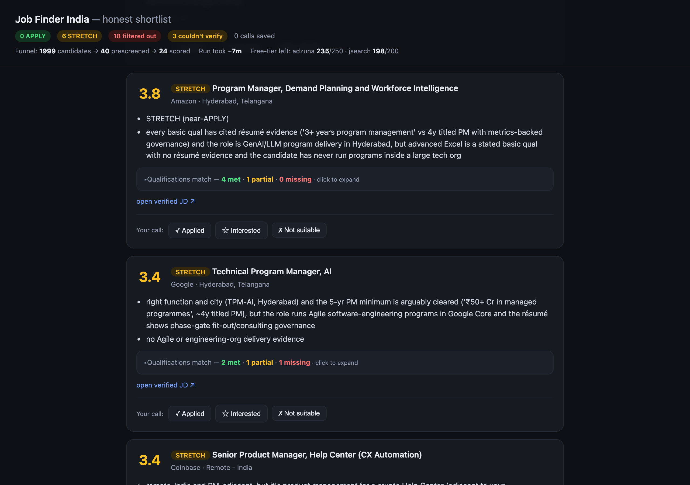

# Job Finder India

**The job-search tool that tells you the truth about fit — it says "don't apply" when it's a no.**


Most AI matchers are optimists: a 70%-there role becomes "4.7/5, great match, here's how to frame
your gaps." That wastes your time and the recruiter's. Job Finder India scores each job **0–5**
against your résumé, treats a gap in seniority or function as a **disqualifier**, and cites the exact
résumé line ↔ job requirement behind every verdict. Fewer, better applications.

Runs entirely on your machine. Your résumé never leaves it, and **the app holds no AI API key** —
scoring runs inside the AI CLI you already use.

### 👉 New here? Start with **[GETTING_STARTED.md](GETTING_STARTED.md)** — the step-by-step guide.

---

## Which AI CLI to use (honest matrix)

Scoring happens **in-session with your CLI's model**, so the model *is* the scorer. That makes this
choice matter more than anything else in setup.

| CLI | Status | Notes |
|---|---|---|
| **Claude Code** | ✅ **Recommended** | Full flow verified end-to-end. Best verdict quality and multi-step reliability. |
| **GitHub Copilot** | ⚠️ Works — pick the model | Verified in-session. On **Free/Student the model is "Auto"-only**, which may route to a small model: expect weaker verdicts and occasional partial runs. On paid plans pick **GPT-5 or Claude Sonnet/Opus**. |
| **Codex** | ⚠️ Works — enable network + switch model | **Its sandbox blocks network by default**, so discovery fails (the tool says so loudly rather than reporting "0 jobs"). Enable network access, and prefer a stronger model. |
| opencode · qwen | ▫️ Runs once authed | CLI-agnostic (Bash + files); not as thoroughly exercised. |
| Antigravity | ▫️ Desktop app | Legacy Gemini CLI → Antigravity. |

A small/default model is a *quality* limit, not a blocker — the tool proceeds either way and warns
once. It also refuses to present a partial run as complete: if scoring stops early you get a
**"Scored N of M — incomplete"** banner, never a silently short list.

## Quickstart

```bash
git clone https://github.com/harshgarg95/job-finder-india && cd job-finder-india
pip install -r requirements.txt
python -m jobfinder onboard      # one-time setup — asks for your résumé, writes your profile
# then open this folder in your AI CLI and say:  find me jobs
```

That's the whole interface. Full detail, troubleshooting, and optional API keys are in
**[GETTING_STARTED.md](GETTING_STARTED.md)**.

Review results in the browser at any time:

```bash
python -m jobfinder dashboard    # local page at http://127.0.0.1:8755 (Ctrl-C to stop)
```



## What it does **not** do

- **No auto-apply, ever.** It recommends; you decide and click Submit. It never applies for you.
- **No stealth scraping and no bot-block evasion.** Discovery and JD fetch use free public ATS
  JSON endpoints — documented APIs for Greenhouse/Lever/Ashby/Workable/SmartRecruiters; for
  Workday, the same public keyless endpoints its own careers pages use — plus official APIs
  (Adzuna). If a site blocks automation, it is **detected and skipped** — never worked around.
- **No credential handling.** It never asks for, stores, or uses your job-board logins. Optional
  discovery keys live in your own `.env` and are sent only to that provider's API.
- **No invented experience.** A high score must be earned by evidence already in your résumé.
- **No spray-and-pray.** It is a filter, not a firehose.

## Cost per run

The app holds **no scoring API key** — scoring cost is whatever your own AI CLI plan already charges
(often zero on an existing subscription; genuinely $0 if you point a local-capable CLI at Ollama).

Discovery is free by default: the **public ATS scan needs no key**. Optional channels (Adzuna,
JSearch) use *your* free tiers, with a per-run request cap and a persisted monthly counter — when a
tier is exhausted or a `429` lands, that channel pauses and discovery degrades to the free floor.
Apify deep-mode is **off by default** and bills to your own account if you enable it.

Volume is bounded by design: a deterministic prescreen cuts candidates to a few dozen
(`config/run.yml` → `prescreen.max_llm_jobs`, default 40) and only the top
`scoring.full_score_top_n` (default 15) are fully scored. **A run cannot balloon into thousands of
calls.** Every run prints the funnel (`candidates → prescreened → scored`) and the free-tier left.

## How your data & credentials are handled

- **Your AI login is never touched.** Scoring runs inside the AI CLI you already use, under that
  assistant's own login — this tool never sees, stores, or transmits your model credentials, and
  holds no AI API key of its own.
- **Job data comes from APIs, not scraping.** Free public APIs — documented ATS APIs, the
  official Adzuna API; for Workday, the public keyless endpoints its own careers pages use —
  plus optional third-party APIs you enable with your own keys (JSearch, SerpAPI, Apify) that do
  their own collection under their own terms. Sites that block bots are **detected and
  skipped** — never scraped around.
- **Your résumé, profile, and results stay on your machine.** `resume.md`, `config/profile.yml`,
  `config/preferences.yml`, `.env`, and everything under `data/` are **gitignored** — never
  committed, never uploaded. The only content that leaves your computer is the job text your own
  AI CLI reads in order to score, under that CLI's terms.
- **Adzuna job links include your Adzuna app id** as a URL parameter — Adzuna requires it for the
  link to resolve. If you share raw results (`top.md`, `scored.jsonl`, screenshots) publicly, that
  id is visible. It is the non-secret half of Adzuna's credential pair; your app key is never
  written to any file or URL.

Full statement: [NOTICE](NOTICE) · [DATA_CONTRACT.md](DATA_CONTRACT.md).

## How it works

```
résumé + profile ─▶ DISCOVERY ─▶ dedup + India/keyword filter ─▶ deterministic PRESCREEN
                                                                  (title · seniority · function ·
                                                                   location — the volume cap)
                                          ─▶ HONEST SCORING in your CLI (prompts/_rubric.md is the law)
                                          ─▶ data/results/top.md  +  data/tracker.md
```

Your CLI reads [`AGENTS.md`](AGENTS.md) + [`modes/`](modes/) and calls small deterministic Python
tools (`doctor`, `discover`, `prescreen`, `enrich`, `tracker`, `live`) for the plumbing — then does
the judging itself. Nothing is scored that the tool could not actually read: unreadable postings go
to a **"Couldn't verify"** bucket instead of being guessed at.

**It learns from your corrections.** Mark a role **Applied / Interested / Not suitable (+reason)** in
the dashboard (or `python -m jobfinder feedback --job <id> --action wrong_location`). Corrections
persist to `data/feedback.jsonl`, are derived into a preference layer, and replay into the next run's
prescreen — already-decided jobs drop out and repeat-rejected patterns are down-ranked (never
hidden). The rubric itself never changes.

## Headless / CI (optional)

The primary mode is the prompt-pack above. A separate batch path exists for automation:

```bash
python -m jobfinder doctor                            # setup check
python -m jobfinder --resume resume.md --cli claude   # headless ranked top-N
```

## Credits & prior art

Built openly on good prior art, reimplemented from scratch (no copied files):

- **[career-ops](https://github.com/santifer/career-ops)** (MIT) — the CLI-agnostic
  markdown-prompt scoring model, rubric-with-citations, and the User-Layer/System-Layer data
  contract are inspired by it. Job Finder India deliberately *inverts* its optimistic scoring: where
  career-ops coaches you to apply, this is built to tell you the honest "no."
- **[Apify](https://apify.com)** — the optional BYO-token deep-discovery layer.

Independent projects; Job Finder India is not affiliated with or endorsed by them.

## License

[MIT](LICENSE) © 2026 Harsh Garg.
